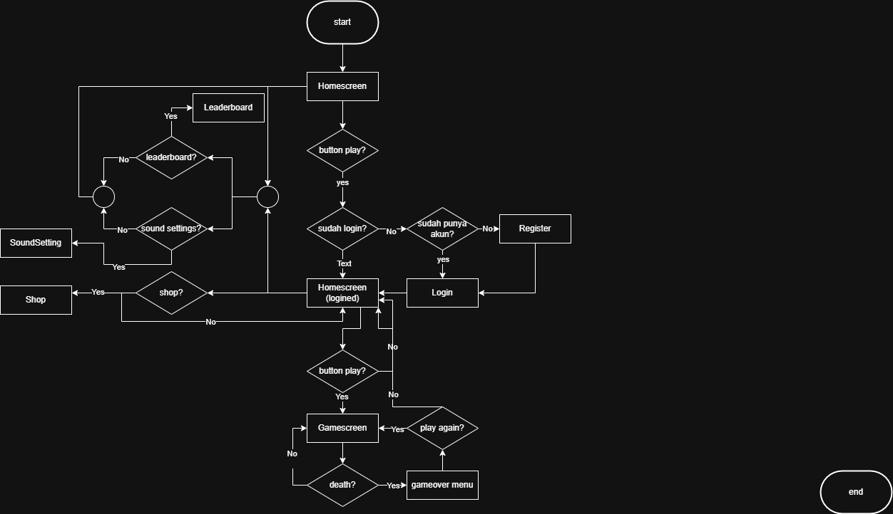

# Neon Runner

Neon Runner is a cyberpunk-themed endless runner game developed as a final project for the Netlab course. This game combines classic gameplay with modern features such as an online leaderboard, power-ups, shop, and account system. The project consists of a frontend (React + TypeScript) and a backend (Spring Boot + Java).

<p align="center">
  
  
  
  
  
  
  
  
  
  
</p>


---

## Table of Contents
- [Neon Runner](#neon-runner)
  - [Table of Contents](#table-of-contents)
  - [Main Features](#main-features)
  - [Technologies Used](#technologies-used)
  - [Project Structure](#project-structure)
  - [How to Run](#how-to-run)
    - [Backend (Spring Boot)](#backend-spring-boot)
    - [Frontend (React)](#frontend-react)
    - [Database](#database)
  - [Feature Explanation](#feature-explanation)
    - [Gameplay](#gameplay)
    - [Leaderboard](#leaderboard)
    - [Shop \& Power-Up](#shop--power-up)
    - [Account \& Authentication](#account--authentication)
    - [UI/UX](#uiux)
  - [Documentation \& Diagrams](#documentation--diagrams)
    - [Screenshots](#screenshots)
    - [ERD (Entity Relationship Diagram)](#erd-entity-relationship-diagram)
    - [UML Diagram](#uml-diagram)
    - [Flowchart](#flowchart)
    - [Database Dump](#database-dump)

---

## Main Features
- **Endless Runner**: The character runs automatically; players must jump/duck to avoid obstacles.
- **Responsive UI**: Adapts to different devices (mobile/desktop, portrait/landscape).
- **Online Leaderboard**: Player scores are stored and displayed globally.
- **Power-Ups**: Double coin, double XP, shield — activated by tapping (mobile) or pressing keys (desktop).
- **Shop**: Buy power-ups with coins earned in-game.
- **Sound & Music**: In-game sound and music settings.
- **Account & Authentication**: Login, registration, and progress saving through user accounts.
- **Game Over & Pause**: Responsive overlays, touch/jump instructions, and consistent navigation buttons.

---

## Technologies Used
- **Frontend**: React, TypeScript, TailwindCSS, Vite
- **Backend**: Spring Boot, Java, REST API
- **Database**: NeonDB
- **Audio**: Howler.js
- **Others**: Lucide React Icons, JWT Auth

---

## Project Structure
```
proyekook/
├── backend/         # Spring Boot backend (Java)
│   ├── src/main/java/com/...
│   ├── src/main/resources/
│   └── ...
├── frontend/        # React frontend (TypeScript)
│   ├── src/components/
│   ├── src/assets/
│   ├── src/styles/
│   └── ...
├── Dokumentasi/     # Screenshot, ERD, UML, Flowchart
├── Kelengkapan/     # dump.sql, diagram, flowchart
└── README.md
```

---

## How to Run

### Backend (Spring Boot)
1. Navigate to the `backend/` folder.
2. Ensure Java & Gradle are installed.
3. Run the following command:
   ```bash
   ./gradlew bootRun
   ```
4. Server will be running at `localhost:8080`.

### Frontend (React)
1. Navigate to the `frontend/` folder.
2. Install dependencies:
   ```bash
   npm install
   ```
3. Run the app:
   ```bash
   npm run dev
   ```
4. Open in browser: `localhost:5173`

### Database
- Import the `dump.sql` file from the `Kelengkapan/` folder into NeonDB.
- Make sure the database configuration in `backend/src/main/resources/application.properties` is correct.

---

## Feature Explanation

### Gameplay
- The character runs automatically; players avoid obstacles by tapping (mobile) or pressing keys (desktop).
- Power-ups are activated by tapping icons (mobile landscape) or using keys 1/2/3 (desktop).
- Coins are collected to purchase power-ups in the shop.

### Leaderboard
- Scores and coins are sent to the backend after game over.
- Leaderboard displays global top players.

### Shop & Power-Up
- Available power-ups: Double Coin, Double XP, Shield.
- Power-ups can be purchased with coins and used during gameplay.

### Account & Authentication
- Register and log in with username & password.
- Progress and coins are saved to the user’s account.

### UI/UX
- Responsive design for both mobile & desktop.
- Overlays (pause, game over, shop, leaderboard) are consistent and user-friendly.

---

## Documentation & Diagrams

### Screenshots
See the `Dokumentasi/` folder for game screenshots.

### ERD (Entity Relationship Diagram)


### UML Diagram


### Flowchart


### Database Dump
- File: `Kelengkapan/dump.sql`
- Contains structure and initial data for the NeonDB database.

---
